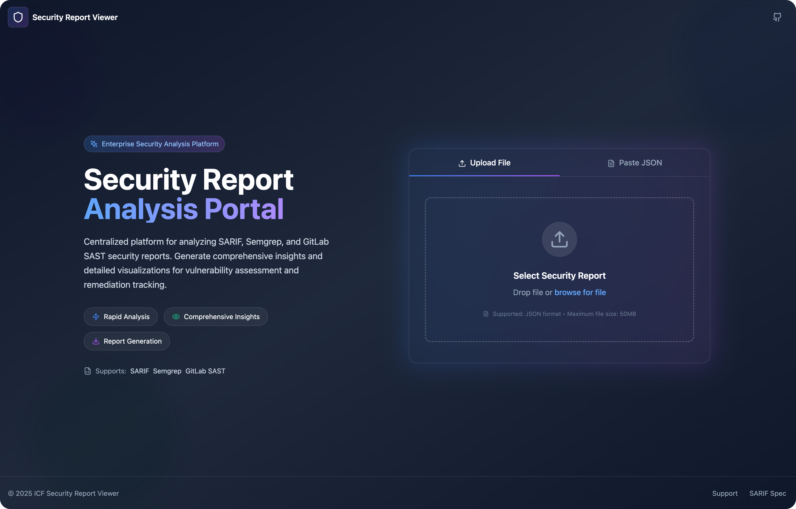
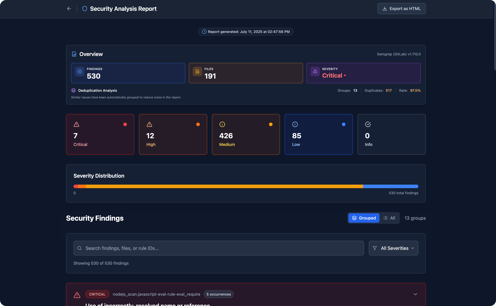
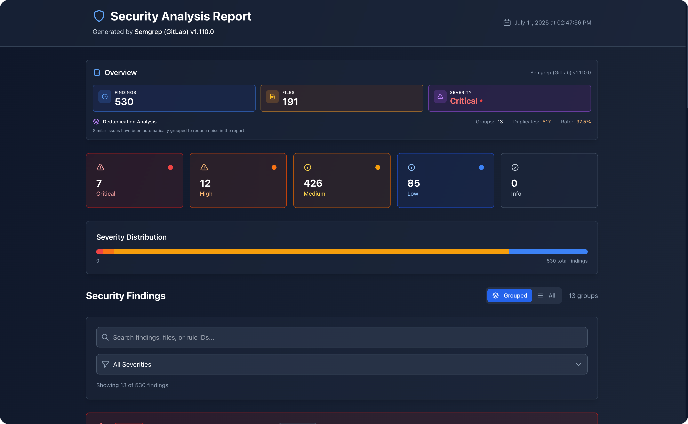
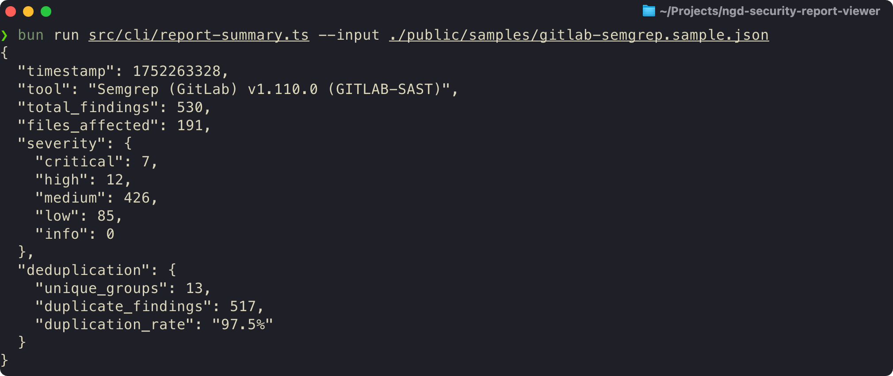

# ICF Security Report Viewer

A versatile security report viewer for SARIF, Semgrep, and GitLab SAST JSON files. View reports locally, export as static HTML, or integrate into CI/CD pipelines.



## Features

- **🖥️ Local Web UI** - Interactive viewer for security reports with filtering and search
- **📄 Static HTML Export** - Generate standalone HTML reports for sharing
- **🤖 CLI Tool** - Command-line interface for automation and scripting
- **🔄 GitHub Action** - Seamless CI/CD integration
- **📊 Report Summaries** - Quick severity count analysis in JSON format

## Supported Formats

- **SARIF** (Static Analysis Results Interchange Format)
- **Semgrep** JSON output
- **GitLab SAST** JSON reports

## Screenshots

### Interactive Report View



### Exported Static HTML



### Report Summary Output



## Installation

### Prerequisites

- [Node.js](https://nodejs.org/) 20.x or higher
- [Bun](https://bun.sh/) package manager

### Quick Install

```bash
# Clone the repository
git clone https://github.com/ICF-Next-Government/icfng-security-report-viewer.git
cd icfng-security-report-viewer

# Install dependencies
bun install
```

## Usage

### 1. Local Web UI (Containerized)

Perfect for development workflows and security remediation cycles.

```bash
# Start the containerized service
make start
```

Visit [http://localhost:9867](http://localhost:9867) in your browser.

**All-in-one command** (requires `gh` CLI):

```bash
gh repo clone ICF-Next-Government/icfng-security-report-viewer && cd icfng-security-report-viewer && make start
```

### 2. CLI Tool

#### Generate HTML Reports

Convert security scan results to static HTML reports:

```bash
# SARIF format
bun src/cli/generate-html-report.ts --input scan.sarif.json --output report.html

# Semgrep format
bun src/cli/generate-html-report.ts --input semgrep_output.json --output report.html

# GitLab SAST format
bun src/cli/generate-html-report.ts --input gl-sast-report.json --output report.html
```

#### Get Report Summary

Quickly analyze severity distribution:

```bash
bun src/cli/report-summary.ts --input scan.sarif.json

# Output:
# {
#   "critical": 0,
#   "high": 5,
#   "medium": 12,
#   "low": 3,
#   "info": 1
# }
```

### 3. GitHub Action

Integrate report generation into your CI/CD workflow:

```yaml
- name: Generate Security Report
  uses: ICF-Next-Government/icfng-security-report-viewer@main
  with:
    in: scan.sarif.json # Input file (default: scan.sarif.json)
    out: report.html # Output file (default: report.html)
```

## Development

### Setup

```bash
# Install dependencies
bun install

# Start development server
bun run dev

# Run type checking
bun run type-check

# Run linter
bun run lint

# Build for production
bun run build
```

### Project Structure

```
icfng-security-report-viewer/
├── src/
│   ├── cli/             # CLI tools
│   ├── components/      # React components
│   ├── types/          # TypeScript definitions
│   └── utils/          # Utility functions
├── public/             # Static assets
├── bin/                # Executable scripts
└── .github/            # GitHub Actions and workflows
```

## Use Cases

- **Security Engineers**: Review and triage vulnerabilities during development
- **DevOps Teams**: Automate report generation in CI/CD pipelines
- **Security Auditors**: Generate professional reports for compliance
- **Development Teams**: Track security remediation progress

## Support

- **Issues**: [GitHub Issues](https://github.com/ICF-Next-Government/icfng-security-report-viewer/issues)
- **Discussions**: [GitHub Discussions](https://github.com/ICF-Next-Government/icfng-security-report-viewer/discussions)
